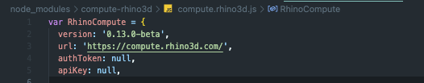
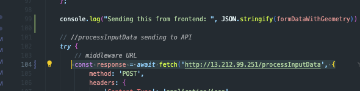

# ePlannerAPI

### Get the project running (for both debugging and production)
**1.** Clone from [the repo](https://github.com/SUTD-UDOpt/ComputeNodeServer )   
**2.** Run `npm install`    
**3.** In the source code of the compute.rhino3d package *(node_modules/compute-rhino3d/compute.rhino3d.js)* , enter the rhinocompute credentials     
**4.** From the frontend *(src/Tools/ParcelOptimizer/utils/userFlowUtils.ts)* make sure it is calling to the correct IP to the API.    

 

### Running the project for debugging
**5.** Now cd into the ComputeNodeServer directory, do `npx tsc` to compile the project. Need to repeat this everytime you make changes to the project.    
**6.** Do `node dist/src/` to run the API    

 

### Running the project for production
**We will be using PM2 for production hosting.**     
**5. a.** If this is the first time running on this aws instance \
cd into the ComputeNodeServer directory, run the script file with `./start.sh`. Follow the instruction prompted in the terminal if any.    

**5. b.** If the instance is already running in production \
After making any changes to the code (git pull etc) run this script file `./refresh.sh`    

   
